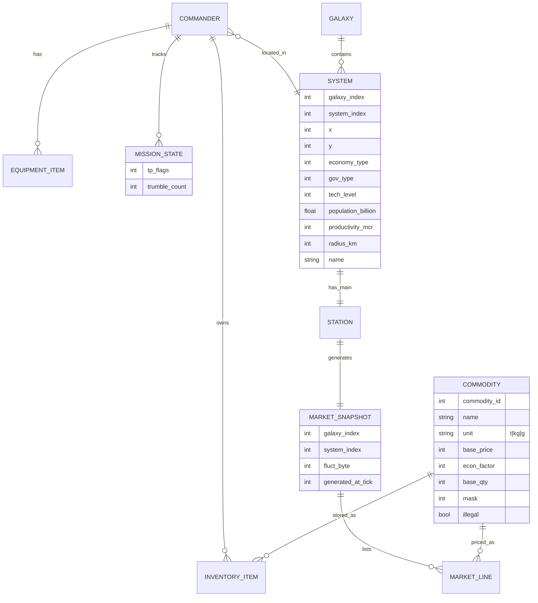

# Non-Travel, Non-Combat Design Document for a Classic Elite Clone

## Executive summary

This report reconstructs the **docked-side simulation** of 1980s *Elite*—specifically the **procedural universe metadata**, **commodity economy and market generation**, **scripted mission logic**, **station-side services**, **persistence/save rules**, and **UI/UX for non-3D screens**—while **explicitly excluding**: (a) the 3D space engine, (b) ship-to-ship combat resolution, and (c) interstellar/interplanetary flight mechanics (fuel consumption, jump execution, docking flight, etc.). Where canonical implementations still *reference* travel/combat (e.g., missions triggered by reaching a system, or completion requiring a kill), those dependencies are treated as **external events** that merely flip state flags. citeturn37view0turn38view0turn39view3

The key findings that make a faithful clone feasible without spaceflight are:

- The universe’s **system roster and attributes** are **fully deterministic** from small seeds: 8 galaxies × 256 systems each. System generation relies on a 6‑byte seed triplet advanced via a **Tribonacci “twist”** (16‑bit wraparound). citeturn8view0turn9view0turn5view2  
- System names are generated from a compact **two-letter token** table (tokens 128–159) and seed bits controlling 3 or 4 digram pairs, with skips creating 2–8 letter names. citeturn9view0turn11view0  
- The dockside economy is not a simulated supply chain: each arrival generates a **market snapshot** from (economy type, a per-visit random byte, and per-commodity parameters). Prices use an 8‑bit formula; quantities use a mod‑64 formula plus clamping. citeturn17view0turn18view0turn15view2  
- Cargo capacity in the canonical trading engine has an important nuance: **only goods measured in tonnes consume hold space**, while kg/g goods (gold, platinum, gem-stones) do **not** reduce holdspace; this is explicitly implemented in a C port of the “precise 6502 algorithms.” citeturn29view1turn40view2turn40view3  
- “Missions” in the 6502 lineage are mostly **scripted state machines** keyed by bitfields in the commander save flag `TP`, evaluated at docking (`DOENTRY`). Rewards are simple wallet/equipment/kill-point mutations. citeturn37view0turn38view0turn38view2turn39view3  

## Evidence base and variant comparison

### Source set and reliability matrix

The table below prioritizes: (1) original documentation scans, (2) original-source-derived implementations, (3) developer interviews, then (4) fan reverse-engineering and ports.

| Source class | Artifact | What it contributes to this design | Notes on reliability / bias |
|---|---|---|---|
| Original documentation | 1984 *Elite* manual scan from 8bs (Acornsoft manual) citeturn34view0turn34view1turn34view2turn34view4turn35view0turn35view2 | Docked trade UI keying, commodity list with “average prices,” illegality notes, and the canonical “Data on System” field set (economy/government/tech/pop/productivity/radius). | Primary, but written partly as in-universe prose; numbers labeled “average” are descriptive, not the actual generation constants. citeturn34view0turn34view4turn35view2 |
| Source-derived reverse-engineering | “Elite on the 6502” analysis by entity["people","Mark Moxon","software archaeology writer"] | Exact tables and formulas as implemented in 6502 sources (seeds, names, market, missions, saves); cross-version diffs. | Extremely high for mechanics, but still an interpretive layer on top of the original sources (commentary can err even if transcribed code is correct). citeturn18view0turn17view0turn9view0turn8view0turn37view0turn3view3 |
| Source port | entity["video_game","Text Elite","c trading engine 1.5"] (C implementation; GitHub mirror) | Confirms trading rules (holdspace behavior, market regen, base seeds, galaxy transform) and documents intent: “precise 6502 algorithms,” explicitly “no combat or missions.” | Valuable for behavioral ambiguities (e.g., cargo units vs holdspace). It is a later artifact, but claims direct conversion from 6502 sources. citeturn29view1turn40view2turn41view1 |
| Developer interview | entity["people","Kean Walmsley","autodesk blogger"] email interview with Ian Bell (2013) | Constraints and process: byte-level memory pressure; collaboration practice; emphasis on squeezing features into tiny memory. | Not a technical spec dump, but strong context for why deterministic compression (procedural generation, tokenized text) was necessary. citeturn24view0 |
| Retrospective interview | 2014 interview in entity["organization","TechRadar","technology news site"] | High-level history: Elite began as combat, trading added as key asset; procedural generation used due to memory constraints. | Broad, not algorithmic; good corroboration of design intent and priorities. citeturn21view2 |

### Variant deltas that affect non-travel/non-combat systems

Even when excluding flight/combat, there are meaningful version differences in the “docked simulation” layer, especially missions.

| Feature | BBC Micro cassette | BBC Micro disc / enhanced BBC line | Commodore 64 / NES | Evidence |
|---|---|---|---|---|
| Constrictor mission | Not present | Present | Present | Mission appears in “every version of 6502 Elite apart from the BBC Micro cassette and Acorn Electron versions.” citeturn39view3 |
| Thargoid Plans mission | Not present | Present | Present | Same exclusion set as above. citeturn38view0 |
| Trumbles mission | Not present | Not present | Present | “Trumbles mission” is an extra feature for C64 and is also in NES. citeturn38view5turn38view4 |
| Commodity parameters (17 goods) | Same core set | Same core set | Same core set (for 6502 family) | The market table `QQ23` is shared across cassette/disc/electron/6502SP/master with only comment variation. citeturn19view0turn18view0 |

## Procedural universe generation

This section specifies the **data model and algorithms** to recreate the system map, system attributes, system names, and “Data on System” panel content—without simulating movement.

### High-level deterministic structure

- Universe comprises **8 galaxies**, each containing **256 systems** (2048 total). citeturn8view0turn9view0turn21view2  
- Each system is defined by three **16‑bit seeds** (`s0`, `s1`, `s2`), stored little-endian in the original implementation. citeturn8view0turn9view0  
- The canonical “system 0” seed set for galaxy 1 (often cited as the starting point) is:  
  `s0 = 0x5A4A`, `s1 = 0x0248`, `s2 = 0xB753`. citeturn8view0turn40view3  

### Galaxy-to-galaxy transform

To generate galaxy *n* (1–8), the seed triplet is transformed by a per-galaxy “twist” applied `n-1` times to each 16‑bit word:

- Define `rotatel(byte)` as: left-rotate a byte by 1 bit (bit7 becomes bit0). citeturn41view0  
- Define `twist(word16)` as applying `rotatel()` to the high byte and low byte independently then recombining. citeturn41view0turn41view1  
- `nextgalaxy(seed)` applies `twist()` to `w0`, `w1`, `w2`. Applying it 8 times cycles back (“Eighth application gives galaxy 1 again”). citeturn41view0turn41view1  
- Galaxy generation then repeatedly calls a per-system generator (`makesystem`) for 256 systems. citeturn41view1  

**Implementation note (modern platforms):** use fixed-width integers (`uint8`, `uint16`) and explicitly mask to 8/16 bits after shifts and adds, to preserve 1980s wraparound semantics. citeturn41view0turn8view0  

### System-to-system seed advance within a galaxy

Within a galaxy, advancing from one system seed triplet to the next is described as moving along a **Tribonacci** sequence (each term is sum of previous 3), with 16-bit wraparound. There is no separate pseudo-random call for star positions: chart coordinates are read directly from the current seed state, while the pseudo-randomness comes from repeatedly twisting the seeds. Twisting once updates:

- `s0' = s1`  
- `s1' = s2`  
- `s2' = s0 + s1 + s2` (mod 65536) citeturn8view0  

A new system in the 256 sequence is derived by twisting the current seeds **four times** before extracting the next system’s seeds. In the canonical generator, `makesystem` reads a system’s position from the current seeds as `x = s1_hi`, `y = s0_hi`; on the long-range chart, `y` is then vertically compressed for display (`chartY = y >> 1`). citeturn8view0turn5view0  

### System name generation

System names are generated (not stored) by selecting **two-letter tokens** from a lookup table and concatenating 3 or 4 such “pairs,” with “skip” behavior producing shorter names. citeturn9view0turn11view0

Algorithm (abstracted from `cpl` routine description):

1. Determine pair count: if bit 6 of `s0_lo` is set → 4 pairs; else → 3 pairs. citeturn9view0  
2. For each pair:
   - Take bits 0–4 of `s2_hi` → value `v` in `[0..31]`.  
   - If `v == 0`: skip this pair (produces shorter overall name).  
   - Else: token index = `128 + v` → map through token table (two-letter string). citeturn9view0turn11view0  
3. Between pairs, “twist the seeds” (Tribonacci update) and repeat until 3–4 pairs processed; restore original seeds afterward. citeturn9view0turn8view0  

Token table (128–159) for the classic 6502 lineage is: AL, LE, XE, GE, ZA, CE, BI, SO, US, ES, AR, MA, IN, DI, RE, A?, ER, AT, EN, BE, RA, LA, VE, TI, ED, OR, QU, AN, TE, IS, RI, ON. citeturn11view0  

**Sample seed ↔ name example:** the seed listing for Lave is shown with `s0_hi=0xAD, s0_lo=0x38` etc, and produces “LA” + “VE” with the third pair skipped, yielding “Lave.” citeturn9view0  

### System attributes for the “Data on System” screen

The “Data on System” screen presents a consistent set of attributes: distance, economy, government, tech level, population, productivity, average radius, and a descriptive species string. citeturn35view2turn5view2turn5view0  

Key extraction rules for the classic generator (expressed in 8-bit terms) include:

- **Coordinates:** `x = s1_hi`, `y = s0_hi`. These are the raw 0–255 system coordinates derived directly from the seed bytes, not a separately generated random pair. The chart renderer then squashes the vertical axis for display, so the plotted long-range-chart `y` is `y >> 1`. citeturn5view0turn8view0  
- **Government:** `(s1_hi >> 3) & 7`. citeturn5view2  
- **Economy:** `economy = s0_hi & 7`, then, if government ≤ 1 (anarchy/feudal), set bit 1 of economy so the system cannot be “Rich” (economy bit-twiddle). citeturn5view2  
- **Tech level:** derived from economy and government with a small base and sign adjustments (exact formula is documented in the generator deep dive). citeturn5view2  
- **Population:** depends on tech level, economy, and government, represented as a decimal “billions” figure. citeturn5view2turn35view2  
- **Productivity:** computed as `((economy ^ 7) + 3) * (government + 4) * population * 8` (as documented), displayed in “M CR.” citeturn5view0turn35view2  
- **Average radius:** `(((s2_hi & 15) + 11) * 256) + s0_hi`, displayed in km. citeturn5view0turn35view2  

**Assumption for numeric-to-label mappings:** the manual lists eight government classes (Corporate State … Anarchy). citeturn35view0 A faithful clone should map generator values 0–7 to these strings; the commonly implemented mapping (0=Anarchy … 7=Corporate State) matches the count and ordering but should be validated against the original label tables if pixel-perfect UI fidelity is required. citeturn35view0turn5view2  

### Required module interfaces

- `generateGalaxy(galaxyIndex: 1..8) -> Galaxy { systems[256] }`  
  Deterministic from base seeds and `nextgalaxy` transform. citeturn41view1turn40view3  
- `generateSystemName(seed: Seed6) -> string`  
  Uses token table 128–159 and 3/4 pair rule with skip logic. citeturn9view0turn11view0  
- `generateSystemData(seed: Seed6) -> SystemData`  
  Returns x,y,economy,gov,tech,pop,productivity,radius,species. citeturn5view2turn5view0turn35view2  

image_group{"layout":"carousel","aspect_ratio":"16:9","query":["BBC Micro Elite long range chart screenshot","Elite 1984 Data on System screen screenshot","Elite procedural galaxy generation diagram tribonacci"],"num_per_query":1}

## Economics and market system

This section specifies the trade goods list, pricing and availability algorithms, hold capacity rules, transaction rules, and illegal goods behavior—sufficient to implement an Elite-like dockside trading loop.

### Commodity catalog and parameters

The canonical 6502 market table `QQ23` defines 17 goods, each with:

- `base_price` (byte 0)  
- `economic_factor` (byte 1 bits 0–4, signed via bit 7)  
- `unit` (byte 1 bits 5–6; expressed in source as `'t'`, `'k'`, `'g'`)  
- `base_quantity` (byte 2)  
- `mask` (byte 3) controlling the magnitude of random variation citeturn18view0turn17view0  

**Canonical `QQ23` table (BBC Micro cassette lineage):** citeturn18view0

| Id | Commodity | Unit | base_price | econ_factor | base_qty | mask |
|---:|---|---|---:|---:|---:|---:|
| 0 | Food | t | 19 | -2 | 6 | 0x01 |
| 1 | Textiles | t | 20 | -1 | 10 | 0x03 |
| 2 | Radioactives | t | 65 | -3 | 2 | 0x07 |
| 3 | Slaves | t | 40 | -5 | 226 | 0x1F |
| 4 | Liquor/Wines | t | 83 | -5 | 251 | 0x0F |
| 5 | Luxuries | t | 196 | +8 | 54 | 0x03 |
| 6 | Narcotics | t | 235 | +29 | 8 | 0x78 |
| 7 | Computers | t | 154 | +14 | 56 | 0x03 |
| 8 | Machinery | t | 117 | +6 | 40 | 0x07 |
| 9 | Alloys | t | 78 | +1 | 17 | 0x1F |
| 10 | Firearms | t | 124 | +13 | 29 | 0x07 |
| 11 | Furs | t | 176 | -9 | 220 | 0x3F |
| 12 | Minerals | t | 32 | -1 | 53 | 0x03 |
| 13 | Gold | kg | 97 | -1 | 66 | 0x07 |
| 14 | Platinum | kg | 171 | -2 | 55 | 0x1F |
| 15 | Gem-Stones | g | 45 | -1 | 250 | 0x0F |
| 16 | Alien items | t | 53 | +15 | 192 | 0x07 |

**Manual-facing catalog:** The manual lists the same goods and explicitly marks **Slaves, Narcotics, Firearms** as illegal (“defined as illegal… so trading in them is risky”), and shows that some goods are measured in kg or g. citeturn34view0turn34view7  

### Economy type axis (0–7)

Market generation depends on a 3‑bit economy type with labels:

0 Rich Industrial; 1 Average Industrial; 2 Poor Industrial; 3 Mainly Industrial; 4 Mainly Agricultural; 5 Rich Agricultural; 6 Average Agricultural; 7 Poor Agricultural. citeturn17view0  

### Price generation algorithm

Per the documented 6502 logic, each commodity’s *internal price* is computed as an **8-bit arithmetic expression** then multiplied:

`price = (base_price + (random AND mask) + economy * economic_factor) * 4`

The resulting stored price is **10×** the displayed unit price (enabling a single decimal place). citeturn17view0turn18view0  

- `random` is a per-visit random byte stored at `QQ26`, regenerated “each time we arrive in a new system.” citeturn17view0turn15view2  
- `mask` controls volatility; e.g., Narcotics uses `0x78` to vary widely while Food uses `0x01` for stability. citeturn17view0turn18view0  

**Modern implementation note:** emulate 8‑bit wrap behavior:

```text
tmp = (base_price + (random & mask) + economy * econ_factor) & 0xFF
price10 = (tmp * 4)   // still within 0..1020
display = price10 / 10 with 1 decimal
```

This wraparound is not an “edge bug,” it is part of the canon and contributes to occasionally surprising prices. citeturn17view0turn8view0  

### Availability (quantity) generation algorithm

Availability is computed similarly, but modulo 64 with a post-check:

`quantity = (base_quantity + (random AND mask) - economy * economic_factor) mod 64`

If the result is negative, quantity is set to 0. citeturn17view0turn18view0  

Interpretation for modern platforms:
- Compute signed intermediate in at least 16-bit.
- If intermediate < 0 → quantity = 0.
- Else quantity = intermediate & 0x3F.

### Cargo bay capacity semantics (tonnes-only constraint)

A subtle but highly consequential rule in the canonical trading engine:

- Hold capacity (“holdspace”) constrains purchases **only when the commodity unit is tonnes**. kg and g goods do not reduce holdspace, and the total space used is the sum of tonne-based goods only. citeturn40view2turn40view3  
- This matches the manual’s emphasis on “20 tonnes” capacity for a starter ship, while still allowing precious metals/gems trading without filling the bay. citeturn34view2turn40view2  

**Implication for clone tuning:** profitability and route choice are heavily influenced by the ability to carry high-value massless-in-hold goods. A faithful clone should preserve this unless explicitly “rebalanced.”

### Transaction and UI rules while docked

From the manual’s docked trading workflow:

- `f7` shows market prices; `f9` shows inventory (cargo, fuel, cash); `f1` enters buying mode; `f2` enters selling mode. citeturn34view1turn34view2  
- The offered prices “will be guaranteed while you are in Trading Mode.” citeturn34view1  
- You cannot buy more than: available quantity, what you can afford, or what fits in the hold (for tonne goods). citeturn34view2turn40view2  
- Buying reduces market quantity; selling increases it in the local market snapshot. citeturn40view2turn40view3  

### Illegal goods handling (non-combat, non-flight framing)

The manual treats illegality mainly as **risk of enforcement** and “incriminatory action.” citeturn34view7turn32view3  
Since this clone excludes flight/combat, implement illegality entirely as **docked-side events**:

- On docking completion, run `contrabandScan()` with probability based on system government (harsher in corporate/democracy, laxer in anarchy) as an **assumption** consistent with the manual’s portrayal of stability vs lawlessness. citeturn35view0turn34view7turn34view4  
- If scanned with illegal cargo:
  - Confiscate illegal items and/or apply a fine.
  - Increment legal status (Clean → Offender → Fugitive) as described in the manual. citeturn32view2turn32view3  

image_group{"layout":"carousel","aspect_ratio":"16:9","query":["Elite 1984 Market Price screen","Elite Buy Cargo screen BBC Micro","Elite inventory screen f9","Elite trade goods list manual"],"num_per_query":1}

## Mission system

“Missions” in the classic 6502 line are **stateful scripted progressions** evaluated at docking time, with state stored in a save-file bitfield `TP`. citeturn37view0turn38view0

### Mission state storage model

- `TP` is a flag byte in the commander save file that stores mission state bits. Docking logic (`DOENTRY`) checks `TP` and the current situation, then displays briefing/debriefing messages and mutates `TP`. citeturn37view0turn38view0  
- Constrictor uses `TP` bits 0–1; Thargoid Plans uses bit 2 (and checks the lower nibble pattern); Trumbles uses bit 4 for “offered” and a separate `TRIBBLE` counter for infestation count. citeturn37view0turn38view0turn38view7  

### Canonical mission templates (non-combat framing)

Because this project excludes combat and travel mechanics, mission **objective completion** is defined as a **state-change input** from an external subsystem (or a debug/admin action). The mission *logic*, *offers*, *routing requirements*, and *rewards* are still implementable exactly.

| Mission | Availability (versions) | Offer / trigger | Progress gates | Completion event input | Reward mutations | Failure conditions |
|---|---|---|---|---|---|---|
| Constrictor | 6502 versions excluding BBC cassette & Electron | Offered when `TP[1:0]==00`, `TALLY+1 > 0` (≥256 extra kill points past “Competent”), and player is in galaxy 1 or 2; accepting sets `TP` bit 0 → `01`. citeturn37view0turn39view3 | While `TP[1:0]==01`, the game supplies system-specific hints via description overrides (route of clue systems). citeturn37view0turn39view0 | External: `constrictorDestroyed = true` (in original: kill routine sets `TP` bit 1). citeturn37view0turn39view0 | +5000 credits and +256 kill points; then clears bit 0 leaving `TP[1:0]==10` (“done”). citeturn39view3turn37view0 | None documented in mission logic; persists until completed (assumption: death resets via reload). citeturn37view0turn3view3 |
| Thargoid Plans | All 6502 versions except BBC cassette & Electron; appears after Constrictor | Requires Constrictor done (`TP[3:0]==0010`), `TALLY+1 >= 5` (≥3/8 from Dangerous→Deadly), and galaxy 3; sets bit 2 → `0110`. citeturn38view0turn38view1turn38view2 | Dock at Ceerdi (215,84) to pick up plans → sets `TP[3:0]==1010`; dock at Birera (63,72) to deliver and debrief → sets `TP[3:0]==1110`. citeturn38view0turn38view1 | External: arrival/docking events at Ceerdi/Birera (in this clone: map selection + “dock” confirm). citeturn38view1 | Fit Naval Energy Unit and +256 kill points (plus state bits updated). citeturn38view2turn38view1 | No explicit failure check documented; mission persists until completion. citeturn38view0 |
| Trumbles | Commodore 64 and NES | Offered once after reaching a credit threshold (C64: 5017.6 CR; NES: 6553.6 CR). Trigger check is `CASH+1 > 0` and `TP bit 4 == 0`; sets bit 4 when offered. citeturn38view5turn38view7 | If accepted: increment `TRIBBLE` to 1; Trumbles then reproduce on system entry and with a 14% chance per main loop iteration; consume food/narcotics. citeturn38view4turn38view7 | External: “accept offer” input. | No reward; it is a purchase/complication. (Canon framing: “offering… for … 5000CR.”) citeturn38view5turn38view4 | Failure is not a condition; it is an ongoing nuisance until removed (removal rules are version-specific; if not implemented, treat as a persistent debuff). citeturn38view7 |

### Mission generation rules

Strictly speaking, classic 6502 Elite missions are **not procedurally generated**; they are **scripted offers** gated by rank, galaxy index, coordinates, and `TP`. citeturn37view0turn38view0  

If you require *procedural* missions for a modern clone (user request), treat this as an explicit **assumption/extension** and keep it separable from “classic mode”:

- Use the same state container shape (`MissionInstance`, state bits, expiry clock) but generate contracts from:
  - economy type and government stability (manual’s “think about a planet’s needs” framing), citeturn34view4turn35view0  
  - player legal status and cargo capacity, citeturn32view2turn40view2  
  - distance between systems computed from chart coords (x,y). citeturn41view1turn5view0  

## Docked gameplay loop, persistence, and data model

### Station model and services

In this clone, “being in a system” is equivalent to “being docked at the system’s main station,” because flight is out-of-scope. The manual makes docking a prerequisite for trade: “must dock … before buying or selling cargo.” citeturn34view2  

Minimum station services to replicate the classic non-3D loop:

- **Status screen**: cash, fuel, legal status, rating, equipment list (display-only for out-of-scope equipment). citeturn32view2turn32view3  
- **Market**:
  - market price list (`f7`),
  - inventory (`f9`),
  - buy flow (`f1`) and sell flow (`f2`). citeturn34view1turn34view2turn40view2  
- **System information**:
  - “Data on System” screen showing economy/government/tech/pop/productivity/radius/species. citeturn35view2  
  - Short-/long-range chart screens to select a destination system (selection does not simulate travel, only changes the current system context). citeturn9view0turn8view0  
- **Incoming messages / mission briefings** shown at dock (mission logic). citeturn37view0turn38view0turn38view5  
- **Save / load commander**. citeturn3view3turn15view3  

### Persistent universe rules

Elite’s dockside economy is best modeled as a **stateless generator** plus a **per-session snapshot**:

- On system entry (dock event), generate a new `QQ26` random byte and compute market prices and quantities from the formulas. citeturn17view0turn15view2turn41view1  
- Within the docked session, buying/selling mutates the *local market snapshot* quantities (and your inventory/cash), but no long-term system economy is stored. citeturn40view2turn40view3  
- On leaving the system and later returning, a new market is generated again (“random byte that changes for each visit”). citeturn15view2turn17view0  

**Starting-system special case:** In the classic behavior replicated by Text Elite, Lave starts with a known fluctuation (`00`) and notes that “availabilities reside in the saved game data” and are otherwise recalculated on hyperspacing (system change). citeturn40view1turn15view3  
For your clone, pick one of two faithful modes:

- **Mode A (most faithful to classic start):** ship starts in Lave with pre-seeded AVL quantities (default commander data), and subsequent system changes recalc quantities from generator. citeturn15view3turn40view1turn17view0  
- **Mode B (simpler):** always regenerate market on entering any system including the start; document as an intentional simplification.

### Save/load rules and canonical fields

The “commander file” in the 6502 lineage is a fixed-size structure that stores player state including the **current system seeds** needed to reconstruct the universe context. The documented save file is **256 bytes**, with about **75 bytes used** and the rest padding/unused. citeturn3view3turn3view4  

The save includes (at minimum):

- player name, cash, fuel, legal status, combat tally, equipped items, cargo quantities, current galaxy/system identifiers, and mission state (`TP`). citeturn3view3turn15view3turn37view0  

**Modern implementation recommendation:** implement two formats:

1. **Canonical-compatible binary** (optional): a 256-byte blob with preserved offsets (useful for regression testing against known saves). citeturn3view3turn3view4  
2. **Modern JSON** (recommended): explicit names, versioning, and checksums; includes PRNG state to preserve deterministic “random-per-visit” behavior. citeturn15view2turn17view0turn41view1  

### Mermaid ER diagram



## Implementation notes and edge cases

### Preserve 8-bit / 16-bit arithmetic semantics

Elite’s “feel” depends on fixed-width overflow:

- Market price components are computed as **8-bit**, then scaled; quantities are mod‑64 with special handling for negative. citeturn17view0turn18view0  
- Seed twisting for system progression is explicitly 16-bit wraparound arithmetic. citeturn8view0  
- Galaxy transform uses per-byte bit-rotation, so implement byte-accurate rotates rather than relying on platform-specific shift behavior. citeturn41view0turn41view1  

### Cargo capacity corner case: kg/g goods

If you “fix” holdspace to include kg/g goods, you will significantly alter progression and route economics. The Text Elite implementation constrains hold only for tonne goods and sums tonne goods only when computing used space. citeturn40view2turn40view3  
A faithful clone should preserve this (or gate any change behind a “rebalanced economy” option).

### Market regeneration timing

The source-port behavior shows markets generated on system change via `genmarket(randbyte(), planet)` and notes that initial Lave has a specific fluctuation and saved availabilities. citeturn41view1turn40view1  
Document your chosen rule explicitly:

- “Market snapshot generated on each (abstract) system arrival; prices fixed during docked session.” citeturn34view1turn17view0  

### Mission failures in a non-combat clone

The canonical dockside mission logic does not document explicit “timeout” or “fail” branches; missions appear to persist until completion, with progress encoded solely in save flags. citeturn37view0turn38view0  
Because your clone removes the combat/travel layer that would normally create practical failure (death, inability to reach systems), you should add a **design-level failure policy** as an assumption:

- Either “no failure unless player resets/loads earlier save,” or
- “expiry after N dockings / N in-game days” (non-canonical; keep optional).

### Requested diagrams and illustrations

For implementation and testing, the most useful additional visuals to gather (beyond what’s embedded in manuals) are:

- A clean capture of the **Market Price** screen and the **Buy/Sell** flows for input validation. citeturn34view1turn34view2  
- Short-/long-range chart screenshots with crosshairs and coordinate mapping for confirming x/y placement. citeturn9view0turn8view0  
- The “Data on System” screen for multiple systems to sanity-check economy/government/tech/pop/productivity/radius formatting. citeturn35view2turn5view0
